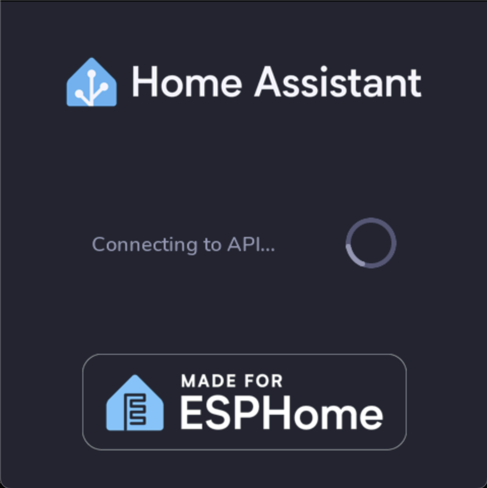

# ERP Mantto ESP32 — ESP32-S3-4848S040

Firmware para el panel **Guition ESP32-S3-4848S040**, con pantalla **480 × 480**, controlador **ST7701S**, táctil **GT911** y comunicación con el sistema Asistente 3C.

El repositorio conserva dos objetivos funcionales separados:

- **ESPHome + LVGL** para la interfaz gráfica del panel.
- **PlatformIO** para el firmware 3C con editor de órdenes, teclado virtual, command buffer y cliente HTTP del dispositivo.

La separación de objetivos es deliberada: la configuración LVGL pertenece al objetivo ESPHome y la interfaz 3C documentada en este README pertenece al objetivo PlatformIO. No se introduce una dependencia independiente <code>lvgl/lvgl</code> en PlatformIO.

## Alcance y arquitectura

La condición de entrada es una orden escrita o editada desde el panel. El diseño trata esa orden como una propuesta controlada y no como una escritura directa sobre una fuente maestra.

~~~text
ESP32-S3-4848S040
├─ ESPHome + LVGL
│  ├─ ST7701S / 480×480
│  └─ GT911
└─ PlatformIO / panel_4848s040
   ├─ editor 3C
   ├─ teclado virtual
   ├─ commandBuffer
   ├─ viewport horizontal
   └─ cliente Device API
             │
             ▼
      Asistente 3C / Device API
             │
             ▼
      pending_confirmation
          ├── applied
          └── rejected

fallo de transporte/protocolo → ERROR
polling del estado → 2.5 s
~~~

La arquitectura separa la interacción, el transporte HTTP, la interpretación, la validación determinista, la revisión humana, la persistencia y el reporte del resultado. Una respuesta HTTP aceptada no significa por sí sola que el cambio ya haya sido aplicado.

El componente de IA del sistema más amplio del Asistente 3C se limita a la interpretación semántica. La persistencia queda fuera de la autoridad del modelo y requiere las validaciones y controles definidos por la aplicación. La implementación productiva de Node.js/React/GenAI no forma parte de este árbol de firmware; el repositorio documenta y prueba su frontera de integración mediante el contrato del dispositivo y los E2E.

## Hardware y configuración

La implementación existente del panel se conserva sin cambiar GPIO, controladores, temporización ni arquitectura.

| Elemento | Configuración documentada |
|---|---|
| Panel | Guition ESP32-S3-4848S040 |
| Resolución | 480 × 480 |
| Display | ST7701S |
| Touch | GT911 por I²C |
| Dirección GT911 | 0x5D |
| I²C | SDA GPIO19 / SCL GPIO45 |
| Backlight | GPIO38 |
| RGB DE / HSYNC / VSYNC / PCLK | GPIO18 / GPIO16 / GPIO17 / GPIO21 |
| SPI de comandos | CLK GPIO48 / MOSI GPIO47 / CS GPIO39 |
| Flash | 16 MB |
| PSRAM | OPI; ESPHome configura 80 MHz |
| Audio, cuando el montaje lo habilita | I²S BCLK GPIO1 / LRCLK GPIO2 / DATA GPIO40 |

La configuración ESPHome utiliza <code>esp32-s3-devkitc-1</code> con **ESP-IDF**. El entorno PlatformIO <code>panel_4848s040</code> utiliza <code>esp32-s3-devkitm-1</code> con **Arduino**. Son dos definiciones de construcción independientes que se conservan para el mismo hardware.

La inicialización del firmware PlatformIO usa <code>st7701_type9_init_operations</code> y el panel RGB de 480 × 480. El mismo marcador es comprobado por <code>scripts/03_verify_guition.sh</code>.

### Advertencia de puertos

ESPHome usa GPIO19 para I²C del GT911 y GPIO20 como parte del bus RGB. El proyecto advierte que ESPHome puede reportar una posible superposición con USB-Serial-JTAG. Esa advertencia es una consideración de uso de puertos durante la validación física; no constituye evidencia de funcionamiento ni de fallo del panel.

## Interfaz ESPHome + LVGL

El archivo [src/main.yaml](src/main.yaml) configura el objetivo ESPHome con LVGL, traducciones, fuentes, widgets, OTA, Wi-Fi, GT911 y ST7701S.

La configuración fija el componente externo de <code>i18n</code> al commit:

<code>alaltitov/esphome@1b487af0ef26ff8e7908d34e415d99cc13fc1f98</code>

La referencia está fijada para reproducibilidad. El proyecto no debe sustituirla por <code>@dev</code> de manera arbitraria.

Las siguientes capturas son activos documentales existentes en <code>doc/images/</code>. Sirven para describir la interfaz; no constituyen evidencia de una prueba física.

### Pantalla principal

### Configuración

### Carga e inicio

## Editor 3C y teclado virtual

El entorno PlatformIO <code>panel_4848s040</code> contiene el editor editable de órdenes.

La fuente de texto en tiempo de ejecución es <code>commandBuffer</code>, con capacidad de **240 caracteres**. La implementación conserva:

- cursor y navegación;
- inserción de caracteres;
- borrado hacia atrás y hacia delante;
- viewport horizontal para texto largo;
- modo <code>ABC/123</code>;
- letras, números y símbolos;
- espacio, backspace y enter;
- cancelación;
- cambio de modo del teclado.

El toque sobre el campo permite aproximar el cursor al carácter seleccionado. Al confirmar con Enter, el texto actual del <code>commandBuffer</code> es el que consume <code>send3CCommand()</code>. El comando por defecto únicamente inicializa el buffer y no reemplaza el contenido editado durante la ejecución.

La interfaz del panel mantiene las zonas de interacción **PROBAR WSL** y **ENVIAR 3C**. La primera comprueba el endpoint; la segunda abre la edición de la orden.

## API del dispositivo

El contrato versionado se encuentra en [contract/device-command-v1.json](contract/device-command-v1.json).

| Operación | Endpoint | Función |
|---|---|---|
| Health | <code>GET /api/device/v1/health</code> | comprobar disponibilidad |
| Crear orden | <code>POST /api/device/v1/commands</code> | enviar una propuesta |
| Estado | <code>GET /api/device/v1/commands/{command_id}</code> | consultar el estado |

El firmware genera una petición con la estructura:

~~~json
{
  "device_id": "panel-4848s040-3c-01",
  "request_id": "panel-4848s040-3c-01-XXXXXXXX-...",
  "text": "Cambia la tarea J10 a mensual"
}
~~~

Cuando hay token configurado, el cliente añade el encabezado <code>X-3C-Device-Token</code>.

El contrato define el protocolo <code>1.0</code>, el transporte HTTP sobre LAN confiable, longitudes máximas para <code>device_id</code>, <code>request_id</code> y <code>text</code>, códigos aceptados de creación/estado, <code>pending_confirmation</code>, autenticación del estado, polling y confirmación humana obligatoria. La escritura directa en una hoja queda explícitamente fuera de este contrato.

### Flujo de estados

~~~text
POST /api/device/v1/commands
          │
          ▼
pending_confirmation
          │
          ├──────────────► applied
          │
          └──────────────► rejected

GET /api/device/v1/commands/{command_id}
          ▲
          │
       polling
       cada 2500 ms

fallo de transporte/protocolo ─────► ERROR
~~~

El firmware consulta el estado cada **2500 ms**. Los estados terminales <code>applied</code> y <code>rejected</code> cierran el ciclo de la orden. Los estados <code>error</code>, <code>failed</code> y <code>fallido</code>, o un estado desconocido, se tratan como error de protocolo.

El ESP32 no ejecuta por sí mismo la confirmación o el rechazo. La aprobación humana pertenece al Monitor web.

### Contrato frente al servicio local de prueba

[backend/device_api.py](backend/device_api.py) es un servicio local de prueba y conserva una implementación simplificada del API. El contrato normativo del dispositivo y la prueba E2E contra el Monitor real utilizan <code>device_id</code>, <code>request_id</code> y <code>text</code>.

Por esa razón, <code>backend/device_api.py</code> se documenta como **harness de prueba**, no como el backend productivo.

La prueba [tests/test_device_api_e2e.py](tests/test_device_api_e2e.py) verifica contra el Monitor real la autenticación, el alta de la orden, la idempotencia por <code>request_id</code>, el estado <code>pending_confirmation</code>, el polling autenticado y el resultado terminal.

## Versiones y dependencias

| Componente | Versión o referencia |
|---|---|
| ESPHome | 2026.8.2 |
| PlatformIO CLI | 6.2.0 |
| plataforma PlatformIO ESP32 | espressif32 6.8.1 |
| GFX Library for Arduino | 1.5.9 |
| Framework PlatformIO | Arduino |
| Framework ESPHome | ESP-IDF |
| i18n externo | commit <code>1b487af0ef26ff8e7908d34e415d99cc13fc1f98</code> |

Las versiones se aseguran desde [scripts/02_tools_guition.sh](scripts/02_tools_guition.sh). La configuración PlatformIO también fija la plataforma y la dependencia GFX.

Las credenciales personales deben permanecer fuera del control de versiones. El patrón disponible es [include/local_config.example.h](include/local_config.example.h); el archivo real <code>include/local_config.h</code> debe mantenerse ignorado por Git.

## Seis bloques de ejecución

El fuente original define seis bloques para WSL/Ubuntu. Como este repositorio se ejecuta sobre el **destino** <code>erp-mantto-esp32</code>, se debe establecer <code>REPO_DIR</code> y utilizar la URL del destino en el Bloque 1.

### Block 1 — clone/update

Para un checkout existente del destino:

~~~bash
export REPO_DIR="$PWD"
REPO_URL=https://github.com/wpv10barza/erp-mantto-esp32.git   bash scripts/01_clone_guition.sh
~~~

Este bloque no instala Python ni compila. El script valida que el remoto sea el esperado.

### Block 2 — tools

Crea o utiliza <code>.venv</code> y asegura:

- ESPHome <code>2026.8.2</code>;
- PlatformIO <code>6.2.0</code>.

~~~bash
export REPO_DIR="$PWD"
bash scripts/02_tools_guition.sh
~~~

### Block 3 — verify

Comprueba archivos y contratos críticos: LVGL, 480 × 480, ST7701S, GT911, componente ESPHome fijado, <code>commandBuffer</code>, teclado virtual, ruta API y polling de 2.5 s.

~~~bash
export REPO_DIR="$PWD"
bash scripts/03_verify_guition.sh
~~~

### Block 4 — ESPHome

Valida y compila [src/main.yaml](src/main.yaml).

Para validación con secretos ficticios:

~~~bash
BUILD_MODE=validate bash scripts/04_esphome_guition.sh
~~~

Para un entorno local con secretos reales:

~~~bash
BUILD_MODE=real bash scripts/04_esphome_guition.sh
~~~

### Block 5 — PlatformIO

Ejecuta las pruebas Python y nativas, y construye:

~~~text
panel_4848s040
~~~

~~~bash
bash scripts/05_platformio_guition.sh
~~~

El resultado esperado incluye <code>.pio/build/panel_4848s040/firmware.bin</code>.

### Block 6 — dispositivo físico

Carga el firmware y abre el monitor serie:

~~~bash
PORT=/dev/ttyACM0 bash scripts/06_flash_monitor_guition.sh
~~~

El script acepta o autodetecta <code>/dev/ttyACM*</code> y <code>/dev/ttyUSB*</code>. Rechaza <code>/dev/ttyS*</code>; un nodo como <code>/dev/ttyS0</code> no debe utilizarse como sustituto del USB serial del ESP32.

Si WSL no muestra el dispositivo, comprobar:

~~~bash
ls -l /dev/ttyACM* /dev/ttyUSB* 2>/dev/null || true
pio device list
lsusb
~~~

La nota de recuperación histórica del fuente indica que una interrupción durante la sustitución de PlatformIO 6.1.19 se reanuda en el **Block 2**.

## Pruebas y evidencia

El repositorio conserva pruebas Python, C++ y E2E:

- [test/command_buffer_regression.py](test/command_buffer_regression.py)
- [test/test_backend_command_buffer/test_main.cpp](test/test_backend_command_buffer/test_main.cpp)
- [test/test_command_text_viewport/test_main.cpp](test/test_command_text_viewport/test_main.cpp)
- [test/test_virtual_keyboard/test_main.cpp](test/test_virtual_keyboard/test_main.cpp)
- [tests/test_command_editor_integration.py](tests/test_command_editor_integration.py)
- [tests/test_device_api_e2e.py](tests/test_device_api_e2e.py)
- [tests/test_panel_state_contract.py](tests/test_panel_state_contract.py)
- [tests/test_wifi_source.py](tests/test_wifi_source.py)
- [e2e/monitor_ui.spec.mjs](e2e/monitor_ui.spec.mjs)

### Qué demuestra cada nivel

| Nivel de evidencia | Demuestra | No demuestra |
|---|---|---|
| Documentación | diseño declarado, contratos y procedimiento | funcionamiento físico |
| Implementación | presencia de código, configuración y dependencias | ejecución exitosa sin compilar/probar |
| Prueba automatizada | resultados de los tests ejecutados | presencia de hardware físico |
| GitHub Actions | validación automática, compilación y E2E software | USB, pantalla, touch o alimentación reales |
| Validación física | comportamiento del ESP32 conectado al hardware | no sustituye las pruebas de software |

## GitHub Actions

### CI

[.github/workflows/ci.yml](.github/workflows/ci.yml) ejecuta sobre <code>ubuntu-latest</code>, usa Python 3.12 y comprueba:

1. sintaxis de los seis scripts;
2. verificación del proyecto;
3. pruebas nativas PlatformIO;
4. contratos Python.

### Firmware CD

[.github/workflows/firmware-cd.yml](.github/workflows/firmware-cd.yml) amplía la validación con:

- ESPHome validate/compile;
- pruebas del Monitor real de <code>wpv10barza/asistente-3c</code>;
- lint y pruebas Node;
- health del Monitor;
- Device API E2E;
- Browser UI E2E con Playwright;
- pruebas nativas;
- compilación de <code>panel_4848s040</code>;
- empaquetado de firmware y manifiesto SHA-256.

El manifiesto distingue explícitamente la evidencia de compilación de la validación física.

### Validación física

[.github/workflows/physical-validation.yml](.github/workflows/physical-validation.yml) es manual y requiere un runner:

~~~text
self-hosted, linux, x64, esp32
~~~

El workflow compila, carga el firmware en el puerto indicado, captura el arranque serie y publica <code>physical-boot.log</code>.

Las verificaciones físicas previstas incluyen:

- ST7701S y renderizado 480 × 480;
- respuesta táctil GT911;
- asociación Wi-Fi;
- PSRAM;
- estabilidad serie por USB-C;
- audio/GPIO cuando el montaje lo incorpora;
- estabilidad de alimentación durante arranque y actividad de red.

Una ejecución de CI en GitHub-hosted runners **no demuestra** por sí sola que un ESP32-S3 real, el ST7701S, el GT911, el USB o la alimentación estén funcionando.

## Inventario de imágenes y ubicación documental

El árbol fuente contiene **84 archivos de imagen**:

- **15** capturas en <code>doc/images/</code>;
- **69** recursos gráficos de ejecución en <code>src/assets/images/</code>.

El README fuente no contiene referencias Markdown a imágenes técnicas. Además, el commit fuente de referencia <code>4ef0e9a6bd55a3a935d14ae8d84aa8d290114b53</code> modificó únicamente el README; no añadió ni modificó imágenes.

Para la documentación se muestran solo las capturas que aportan contexto de interfaz:

- <code>doc/images/home.png</code> → pantalla principal;
- <code>doc/images/settings.png</code> → configuración;
- <code>doc/images/loading.png</code> → carga/inicio.

Los demás recursos gráficos se conservan como activos del firmware y no se presentan como evidencia independiente.

No se encontró en el árbol fuente una imagen dedicada al hardware físico, un diagrama específico del flujo API, una captura específica del editor/teclado 3C o una fotografía de validación USB. Por ello, no se incorporó evidencia visual inventada.

## Estructura del repositorio

La importación conserva la estructura funcional completa:

~~~text
.github/
  ISSUE_TEMPLATE/
  workflows/
    ci.yml
    firmware-cd.yml
    physical-validation.yml
backend/
contract/
doc/
  images/
docs/
e2e/
include/
platformio/
  src/
    panel_4848s040/
scripts/
src/
  assets/
  common/
  translations/
  widgets/
test/
tests/
gen_he.py
platformio.ini
LICENSE
README.md
.gitignore
~~~

Los componentes principales son:

- <code>src/</code>: ESPHome + LVGL + ST7701S + GT911.
- <code>platformio/src/panel_4848s040/</code>: firmware 3C, editor, teclado y cliente API.
- <code>include/</code>: command buffer, viewport y teclado.
- <code>backend/</code>: servicio local de prueba.
- <code>contract/</code>: contrato HTTP.
- <code>e2e/</code>, <code>test/</code> y <code>tests/</code>: validación de software.
- <code>scripts/</code>: seis bloques reproducibles.
- <code>.github/workflows/</code>: CI, CD y validación física.

## Documentación complementaria

- [docs/ESP32-FIRMWARE-BACKEND-README.md](docs/ESP32-FIRMWARE-BACKEND-README.md)
- [docs/api-e2e.md](docs/api-e2e.md)
- [docs/physical-validation.md](docs/physical-validation.md)
- [docs/validation-matrix.md](docs/validation-matrix.md)

La documentación académica que utilice esta información debe conservar la lógica **condición → diseño → implementación → evidencia → limitación**, sin crear una numeración paralela dentro de este README.

## Consolidación y comparación

Antes de modificar el destino se leyeron y compararon ambos README completos.

El **README fuente** de <code>wpv10barza/ESP32-S3-4848S040</code>, rama <code>main</code>, tiene 21 108 bytes y blob <code>0c33d6c53a2e0f52a200546396b94cf31b5c7b03</code> en el commit de referencia.

El **README destino preexistente** fue leído antes de la consolidación. Aportaba una descripción más breve de la importación y de la separación entre software y validación física, además de una sección académica extensa con numeración propia. Esa información útil se integró aquí en una sola estructura, mientras que los apartados duplicados, marcadores que no pertenecen al árbol de este repositorio y afirmaciones visuales no respaldadas fueron eliminados o corregidos.

La comparación del árbol funcional produjo:

| Elemento | Fuente | Destino antes de la consolidación | Resultado |
|---|---:|---:|---|
| Archivos fuente | 189 | 189 equivalentes ya importados | 189 conservados |
| Archivos faltantes | 0 después de la importación | 0 | sin faltantes |
| README | diferente | presente | reemplazado por uno integrado |
| Workflows temporales de importación | no existen | presentes | retirados |
| Activos funcionales | presentes | presentes | conservados |

No se hizo una concatenación literal ni una sustitución ciega del README.

## Procedencia

La versión consolidada utiliza como referencia:

- **Fuente:** <code>wpv10barza/ESP32-S3-4848S040</code>
- **Rama:** <code>main</code>
- **Commit fuente:** [4ef0e9a6bd55a3a935d14ae8d84aa8d290114b53](https://github.com/wpv10barza/ESP32-S3-4848S040/commit/4ef0e9a6bd55a3a935d14ae8d84aa8d290114b53)
- **README fuente:** blob <code>0c33d6c53a2e0f52a200546396b94cf31b5c7b03</code>
- **Árbol fuente:** <code>f75e091d38c6672ed16ffcdc7ea78a7b80c7ec52</code>
- **Destino:** <code>wpv10barza/erp-mantto-esp32</code>
- **Rama destino:** <code>main</code>

El firmware, GPIO, ST7701S, GT911, PSRAM, flash, API, estados, temporización, dependencias y pruebas se mantienen según el snapshot fuente utilizado. La consolidación realizada sobre este repositorio es documental y no rediseña la arquitectura funcional.

## Consolidación documental de la fuente técnica

Esta versión del README se consolidó después de leer y comparar directamente el `README.md` de `wpv10barza/ESP32-S3-4848S040` en la rama `main` antes de modificar el repositorio destino.

**Referencia de sincronización**

- Repositorio fuente: `wpv10barza/ESP32-S3-4848S040`
- Rama fuente: `main`
- Commit fuente utilizado: `4ef0e9a6bd55a3a935d14ae8d84aa8d290114b53`
- Árbol fuente: `f75e091d38c6672ed16ffcdc7ea78a7b80c7ec52`
- Blob del README fuente: `0c33d6c53a2e0f52a200546396b94cf31b5c7b03`

La comparación realizada antes de esta edición mostró que el repositorio destino ya contenía el mismo árbol funcional del firmware: ambos repositorios resolvían al árbol `f75e091d38c6672ed16ffcdc7ea78a7b80c7ec52`, con 189 archivos en total y los mismos blobs para la estructura, contratos, pruebas, scripts, PlatformIO, ESPHome y workflows. Por ello, **no fue necesario reemplazar ni eliminar archivos de firmware** en esta consolidación; el destino ya contenía el snapshot completo de la fuente.

### Inventario de imágenes

El README fuente no contiene referencias Markdown a imágenes. El árbol del proyecto sí conserva:

- 16 imágenes de documentación bajo `doc/images/`;
- los activos de interfaz bajo `src/assets/images/`;
- las fuentes bajo `src/assets/fonts/`.

Las 16 imágenes de `doc/images/` ya están presentes en el destino y coinciden con los mismos SHA del repositorio fuente, por lo que no fue necesario copiarlas nuevamente ni introducir duplicados. Ninguna imagen se presenta aquí como evidencia de funcionamiento físico del panel.

### Niveles de evidencia

La documentación distingue entre:

**Documentación:** lo declarado por el README y los archivos de configuración.

**Implementación:** lo presente en el código y en el árbol del repositorio.

**Pruebas automatizadas:** pruebas Python/C++ y ejecuciones definidas por los workflows.

**GitHub Actions:** validaciones de código, contratos, compilación y pruebas que el workflow realmente ejecuta.

**Validación física:** requiere un ESP32-S3 real conectado al hardware; la CI en la nube no demuestra por sí sola el funcionamiento eléctrico del ST7701S o del GT911.

Esta consolidación conserva la arquitectura, GPIO, contratos, estados, temporización y dependencias documentadas por la fuente técnica y no constituye un rediseño del firmware.
