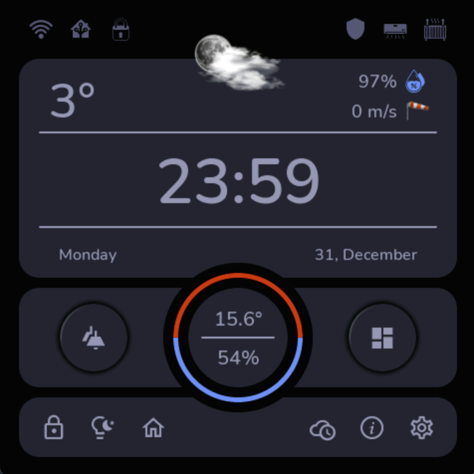
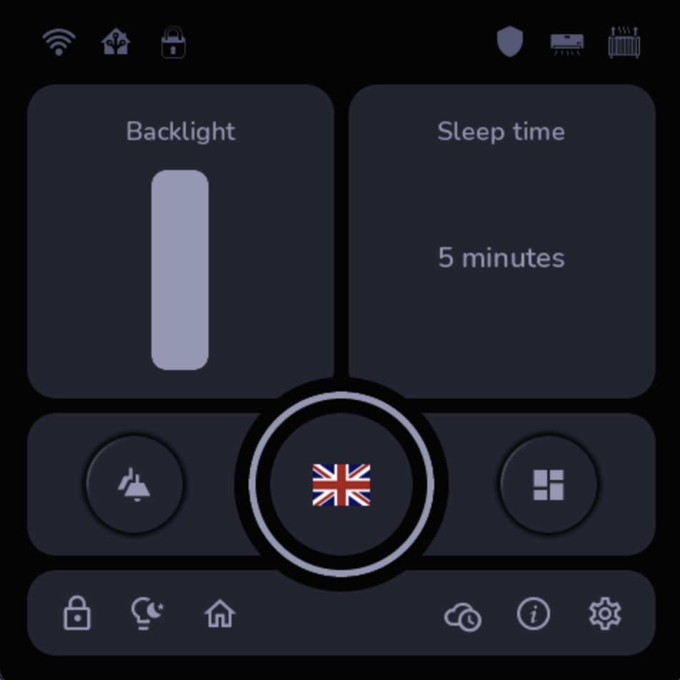

# ERP Mantto ESP32 — ESP32-S3-4848S040

Firmware para el panel Guition ESP32-S3-4848S040 de 480×480 y su interfaz 3C con el Asistente 3C. Este repositorio contiene el árbol de firmware importado desde `wpv10barza/ESP32-S3-4848S040` y conserva sus objetivos de compilación, contratos, pruebas, scripts y workflows.

> **Fuente técnica de referencia:** `wpv10barza/ESP32-S3-4848S040` · rama `main` · commit `4ef0e9a6bd55a3a935d14ae8d84aa8d290114b53`.

## Alcance

El sistema tiene dos objetivos de firmware separados:

- **ESPHome + LVGL** para la interfaz gráfica del panel.
- **PlatformIO** para el firmware 3C con editor de comandos, teclado virtual y cliente de la API del dispositivo.

La separación evita que una pila de interfaz sustituya a la otra. La arquitectura del dispositivo está orientada a presentar una orden, enviarla al backend, esperar la revisión humana y consultar su estado; el ESP32 no ejecuta directamente la confirmación o el rechazo.

## Arquitectura

```text
ESP32-S3-4848S040
  ├─ Pantalla ST7701S · 480×480
  ├─ Táctil GT911 · I²C
  ├─ ESPHome + LVGL
  └─ PlatformIO / interfaz 3C
       ├─ Editor de comandos
       ├─ Teclado virtual
       ├─ commandBuffer
       ├─ viewport horizontal
       └─ Cliente Device API
              |
              v
      Asistente 3C / Device API
              |
              v
      pending_confirmation
          ├── applied
          └── rejected

Error de transporte o protocolo → ERROR
Polling del dispositivo → 2,5 s
```

El contrato del dispositivo separa el transporte de la decisión transaccional. El dispositivo no llama directamente a los endpoints de confirmación o rechazo.

## Hardware documentado

El repositorio fuente documenta:

- **ESP32-S3** como plataforma de procesamiento.
- **Panel 480×480** con controlador **ST7701S**.
- **GT911** como controlador táctil I²C.
- **16 MB de flash**.
- **PSRAM OPI**.
- Entorno PlatformIO `panel_4848s040`.
- Biblioteca `GFX Library for Arduino 1.5.9`.
- Plataforma PlatformIO `espressif32@6.8.1`.
- Framework Arduino para el objetivo PlatformIO.

La configuración ESPHome utiliza ESP32-S3, 16 MB de flash, PSRAM en modo octal y LVGL. El archivo `src/main.yaml` mantiene un componente externo de ESPHome fijado al commit `1b487af0ef26ff8e7908d34e415d99cc13fc1f98` para reproducibilidad.

### Advertencia de puertos

La configuración actual utiliza **GPIO19** para el bus I²C del GT911 y **GPIO20** como parte del bus RGB de la pantalla. ESPHome puede advertir una posible superposición con USB-Serial-JTAG. Esta advertencia debe tratarse como una consideración de uso de puertos durante la validación física, no como evidencia de funcionamiento o fallo del panel.

## Interfaz ESPHome + LVGL

El objetivo ESPHome se encuentra en `src/main.yaml`. Incluye LVGL, traducciones, fuentes, widgets, OTA, Wi-Fi, el controlador GT911 y la configuración ST7701S de 480×480.

El repositorio conserva imágenes de referencia de la interfaz en `doc/images/`. La documentación fuente no utiliza imágenes Markdown en su README; las imágenes se mantienen como activos del proyecto. Se muestran aquí dos referencias representativas de la interfaz:





El árbol también conserva los activos utilizados por el firmware en `src/assets/images/` y las fuentes en `src/assets/fonts/`.

## Interfaz 3C y editor de comandos

El firmware PlatformIO proporciona un campo de edición de comandos con:

- cursor y navegación;
- inserción;
- eliminación hacia atrás y hacia delante;
- desplazamiento horizontal del texto;
- `commandBuffer` como fuente de texto en tiempo de ejecución;
- teclado virtual con modos `ABC/123`, números y símbolos;
- espacio, retroceso y enter.

Los componentes principales son:

```text
include/command_buffer.h
include/command_text_viewport.h
include/virtual_keyboard.h

platformio/src/panel_4848s040/main.cpp
```

Las pruebas nativas verifican capacidad, límites del cursor, edición en posiciones intermedias, visibilidad del cursor, viewport y límites táctiles sin solapamiento.

## API del dispositivo

El contrato `contract/device-command-v1.json` define:

| Operación | Ruta | Función |
|---|---|---|
| Health | `GET /api/device/v1/health` | Comprobar disponibilidad |
| Crear comando | `POST /api/device/v1/commands` | Crear una orden |
| Estado | `GET /api/device/v1/commands/{command_id}` | Consultar la orden |

Autenticación:

```text
X-3C-Device-Token
```

Condiciones del contrato:

- versión de protocolo: `1.0`;
- transporte: HTTP sobre LAN confiable;
- códigos aceptados para creación/estado: `200` y `202`;
- estado inicial: `pending_confirmation`;
- `request_id` para idempotencia;
- polling de estado habilitado;
- escritura directa a hojas: **no**;
- confirmación humana: **obligatoria**.

### Flujo de estados

```text
POST /api/device/v1/commands
        |
        v
pending_confirmation
        |
        +------> applied
        |
        +------> rejected

device polls every 2.5 s
transport/protocol failure -> ERROR
```

Una respuesta HTTP `202` confirma la recepción de la solicitud; no equivale a autorización de persistencia.

## Evidencia de implementación y límites

El repositorio distingue entre implementación y verificación:

**Implementación** — código de pantalla, tacto, Wi-Fi, editor, API, estados y scripts.

**Pruebas automatizadas** — Python/C++, pruebas nativas de PlatformIO y pruebas del contrato de dispositivo.

**GitHub Actions** — validan código, contratos, pruebas, compilación ESPHome y compilación del firmware.

**Validación física** — requiere un ESP32-S3 real conectado a un runner `self-hosted`, carga del firmware y captura del registro serial.

La CI en la nube **no demuestra por sí sola** que un ESP32-S3, un ST7701S o un GT911 reales estén eléctricamente conectados y funcionando.

## Seis bloques de ejecución

El README fuente organiza la reproducibilidad en seis bloques para WSL/Ubuntu.

### Bloque 1 — clone/update

Actualiza o clona el repositorio de origen. No instala Python ni compila.

En este repositorio destino el árbol ya está presente; por tanto, para trabajar sobre el checkout actual se puede comenzar por el Bloque 2 estableciendo `REPO_DIR=$PWD`.

### Bloque 2 — herramientas

Crea `.venv` e instala exactamente:

- ESPHome `2026.8.2`;
- PlatformIO `6.2.0`.

Es seguro volver a ejecutar este bloque después de una interrupción.

```bash
export REPO_DIR="$PWD"
bash scripts/02_tools_guition.sh
```

### Bloque 3 — verificación

Comprueba, entre otros elementos:

- LVGL;
- 480×480;
- ST7701S;
- GT911;
- componente ESPHome fijado;
- command buffer;
- teclado virtual;
- ruta API 3C;
- polling de 2,5 s;
- archivos y contratos requeridos.

```bash
bash scripts/03_verify_guition.sh
```

### Bloque 4 — ESPHome

Valida y compila `src/main.yaml`.

Para validación tipo CI:

```bash
BUILD_MODE=validate bash scripts/04_esphome_guition.sh
```

Para secretos reales locales:

```bash
BUILD_MODE=real bash scripts/04_esphome_guition.sh
```

### Bloque 5 — PlatformIO

Ejecuta las pruebas de regresión nativas y construye:

```text
panel_4848s040
```

```bash
bash scripts/05_platformio_guition.sh
```

### Bloque 6 — dispositivo físico

Carga el firmware y abre el monitor serial.

```bash
bash scripts/06_flash_monitor_guition.sh
```

O especifica el puerto real:

```bash
PORT=/dev/ttyACM0 bash scripts/06_flash_monitor_guition.sh
```

Los puertos `/dev/ttyS*` se rechazan porque corresponden a puertos serie heredados; para el USB serial del ESP32 se esperan `/dev/ttyACM*` o `/dev/ttyUSB*`.

## GitHub Actions

### CI

`.github/workflows/ci.yml`:

- usa Python 3.12;
- instala PlatformIO 6.2.0;
- valida la sintaxis de los seis scripts;
- ejecuta el Bloque 3;
- ejecuta pruebas nativas de PlatformIO;
- ejecuta contratos Python.

### Firmware CD

`.github/workflows/firmware-cd.yml`:

- ejecuta verificación, ESPHome y pruebas;
- inicia el Monitor Asistente 3C para pruebas E2E;
- ejecuta Device API E2E;
- ejecuta Browser UI E2E con Playwright;
- construye el firmware `panel_4848s040`;
- publica `firmware.bin`, `bootloader.bin`, `partitions.bin`, `firmware.elf`, `flash-layout.txt`, `SHA256SUMS.txt` y `manifest.json`.

La manifestación de CD identifica expresamente la compilación como:

```text
compiled_not_physically_flashed
```

### Validación física

`.github/workflows/physical-validation.yml` se ejecuta manualmente en un runner:

```text
self-hosted / linux / x64 / esp32
```

Recibe el puerto serie, compila, carga el firmware y conserva `physical-boot.log` como artefacto. La ruta de puerto esperada es `/dev/ttyACM*` o `/dev/ttyUSB*`.

## Pruebas

El árbol importado conserva pruebas Python y C++:

```text
test/command_buffer_regression.py
test/test_backend_command_buffer/test_main.cpp
test/test_command_text_viewport/test_main.cpp
test/test_virtual_keyboard/test_main.cpp

tests/test_command_editor_integration.py
tests/test_device_api_e2e.py
tests/test_panel_state_contract.py
tests/test_wifi_source.py
```

### Device API E2E

`tests/test_device_api_e2e.py` prueba contra el Monitor Asistente 3C real que:

1. el servicio esté saludable;
2. una orden sin token sea rechazada;
3. una orden autenticada pase a `pending_confirmation`;
4. `request_id` mantenga idempotencia;
5. la orden pendiente sea visible;
6. el polling autenticado funcione;
7. una confirmación humana produzca `applied`;
8. el siguiente polling observe el estado terminal.

La prueba no requiere credenciales de Google ni hardware físico.

## Estructura del repositorio

```text
.github/
  workflows/
    ci.yml
    firmware-cd.yml
    physical-validation.yml

backend/
contract/
doc/
  images/
docs/
e2e/
include/
platformio/
platformio.ini
scripts/
src/
test/
tests/
LICENSE
README.md
```

Los principales bloques son:

- `src/`: ESPHome + LVGL + ST7701S + GT911.
- `platformio/src/panel_4848s040/`: firmware 3C, editor, teclado y cliente API.
- `include/`: command buffer, viewport y teclado.
- `backend/`: servicio local de pruebas de API.
- `contract/`: contrato HTTP del dispositivo.
- `e2e/`: pruebas de interfaz.
- `test/` y `tests/`: pruebas nativas, regresión, Wi-Fi, estados y API.
- `scripts/`: seis bloques reproducibles.
- `.github/workflows/`: CI, CD y validación física.

## Imágenes y activos

La comparación de los README mostró que el README fuente **no contiene enlaces Markdown a imágenes ni URLs externas**. Sin embargo, el repositorio fuente contiene:

- **16 imágenes** de documentación bajo `doc/images/`;
- **68 imágenes** de interfaz bajo `src/assets/images/`;
- **6 fuentes** bajo `src/assets/fonts/`.

No se colocan todas las imágenes al inicio del README: los activos permanecen en sus rutas funcionales y solo se muestran aquí referencias que ayudan a entender la interfaz gráfica. No existe en el repositorio fuente una fotografía física del panel que pueda utilizarse como prueba de funcionamiento.

## Referencias y reproducibilidad

- Repositorio fuente: `wpv10barza/ESP32-S3-4848S040`
- Rama fuente: `main`
- Commit fuente importado: `4ef0e9a6bd55a3a935d14ae8d84aa8d290114b53`
- README fuente: blob `0c33d6c53a2e0f52a200546396b94cf31b5c7b03`
- Componente ESPHome fijado: `alaltitov/esphome@1b487af0ef26ff8e7908d34e415d99cc13fc1f98`
- Monitor Asistente 3C utilizado por Firmware CD: `d67465d82d9e81b307492c8f17c3f359e01abffd`

El firmware se ha importado como árbol funcional, sin convertir esta consolidación documental en un rediseño de la arquitectura ni alterar GPIO, estados, contratos, temporización o dependencias declaradas por el repositorio fuente.

## Nota de consolidación

Antes de esta integración, `erp-mantto-esp32` contenía un README y un workflow de importación, pero no el árbol completo de firmware. La comparación registró **189 archivos en el repositorio fuente frente a 2 archivos en el destino**, con 188 archivos fuente ausentes y un README diferente. El README final se construye a partir de esa comparación y no mediante concatenación de ambas versiones.

El resultado final conserva una única descripción técnica coherente y explícita de sus niveles de evidencia: documentación, implementación, pruebas automatizadas, GitHub Actions y validación física.
