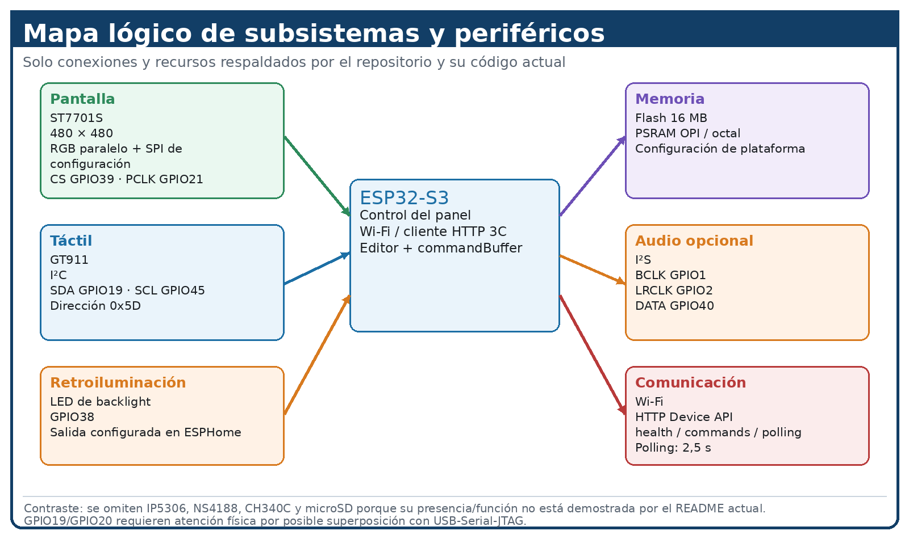
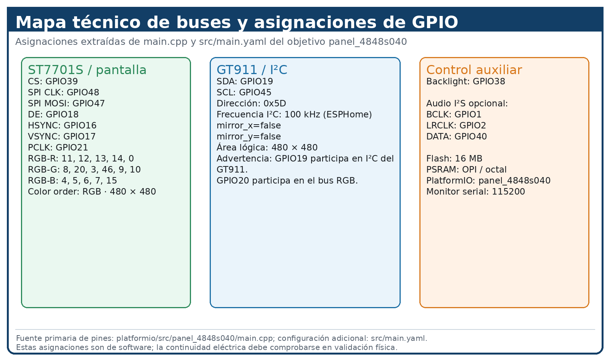

# ERP Mantto ESP32 — ESP32-S3-4848S040

## Estado actual: integración directa con Databricks Apps

El firmware PlatformIO del panel ESP32-S3-4848S040 está preparado para usar como backend de producción la app **asistente-cloud-erp** en Databricks Apps. La ruta productiva es **Wi-Fi → OAuth 2.0 M2M de Databricks → HTTPS Device API → revisión humana → Google Sheets**. El panel no depende de que WSL, Docker, Express u Ollama estén ejecutándose en el equipo local.

Databricks Apps exige autenticación para clientes externos. Por ello, el firmware obtiene un token OAuth temporal mediante un **Databricks service principal**, lo conserva solo en RAM y lo renueva antes de expirar. Además mantiene el encabezado de aplicación **X-3C-Device-Token**. Los secretos permanecen únicamente en `include/local_config.h`, que está excluido de Git.

La interfaz física usa las etiquetas **DATABRICKS LISTO** y **PROBAR CLOUD**. El firmware productivo no usa mDNS, IP privada, loopback ni descubrimiento de un backend local. Solo resuelve por DNS el hostname HTTPS de Databricks Apps.

Firmware para el panel **Guition ESP32-S3-4848S040**, con pantalla **480 × 480**, controlador **ST7701S**, táctil **GT911** y comunicación con el sistema Asistente 3C.

El repositorio conserva dos objetivos funcionales separados:

- **ESPHome + LVGL** para la interfaz gráfica del panel.
- **PlatformIO** para el firmware 3C con editor de órdenes, teclado virtual, command buffer y cliente HTTP del dispositivo.

La separación de objetivos es deliberada: la configuración LVGL pertenece al objetivo ESPHome y la interfaz 3C documentada en este README pertenece al objetivo PlatformIO. No se introduce una dependencia independiente <code>lvgl/lvgl</code> en PlatformIO.

## 2. Bases teóricas y arquitectura

La base teórica y arquitectónica del sistema se apoya en la separación funcional entre procesamiento, visualización, interacción táctil, memoria y comunicación. La figura seleccionada resume esa distribución sin utilizar una captura de interfaz como evidencia.



**Figura 2.1. Mapa lógico de subsistemas y periféricos del ESP32-S3-4848S040.**

**Nota.** La figura tiene función documental y sirve para contextualizar las bases técnicas y la arquitectura del panel. No representa una prueba física de funcionamiento ni sustituye la validación del hardware.

## 3.1. Enfoque del sistema

El sistema se concibe como una solución embebida de interacción y comunicación controlada para el Asistente 3C. El panel ESP32-S3-4848S040 constituye el punto de interacción local y concentra la visualización, la entrada táctil, la edición de instrucciones y la comunicación con la Device API. El procesamiento posterior se mantiene fuera de la autoridad directa del panel: la orden se transporta al servicio correspondiente, atraviesa el flujo de interpretación y validación establecido y permanece sujeta a revisión humana antes de cualquier aplicación autorizada.

La organización documental adopta la secuencia **condiciones iniciales → diseño → integración → implementación → validación → trazabilidad**. Esta separación evita confundir una característica declarada o configurada con evidencia de funcionamiento físico y sigue el patrón de organización documental utilizado como referencia académica.

## 3.2. Condiciones iniciales

Las condiciones iniciales describen el punto de partida técnico que delimita el diseño. No representan todavía decisiones de implementación ni resultados de prueba.

### 3.2.1. Condiciones iniciales del hardware y periféricos

El sistema parte de un panel Guition ESP32-S3-4848S040 con resolución de **480 × 480**, pantalla basada en **ST7701S** y controlador táctil **GT911**. La configuración registrada para el objetivo PlatformIO `panel_4848s040` contempla **16 MB de Flash**, **OPI PSRAM** y framework Arduino. El objetivo ESPHome mantiene por separado la configuración de interfaz con LVGL.

### 3.2.2. Condiciones iniciales del sistema transaccional de estados

El contrato de dispositivo parte de un ciclo de orden en el que la creación conduce a `pending_confirmation`, la aplicación autorizada conduce a `applied` o `rejected`, y los fallos de transporte o protocolo se tratan como error. El firmware consulta el estado aproximadamente cada **2.5 s** y no realiza por sí mismo la confirmación o el rechazo.

### 3.2.3. Condiciones iniciales del sistema de identificación y comunicación

La comunicación de producción se realiza mediante la Device API versionada sobre HTTPS hacia Databricks Apps, con OAuth 2.0 M2M en el borde de Databricks y `X-3C-Device-Token` en la aplicación. El ESP32 puede usar cualquier red que le dé salida a Internet; no necesita estar en la misma Wi-Fi o subred que una PC. La solicitud utiliza `device_id`, `request_id` y `text`; cuando está configurado, el cliente añade el encabezado de autenticación `X-3C-Device-Token`. El contrato define endpoints para health, creación de órdenes y consulta de estado.

### 3.2.4. Condiciones iniciales de alimentación y estabilidad

La operación física depende de un ESP32-S3 conectado, del arranque correcto de la pantalla y del subsistema táctil, de la estabilidad de la alimentación y de la disponibilidad de USB/serie y red. La configuración vigente debe considerar que **GPIO19** participa en I²C del GT911 y **GPIO20** forma parte del bus RGB; las advertencias asociadas a estos recursos son una condición de validación y no una prueba de funcionamiento.

### 3.2.5. Condiciones iniciales del sistema de control centralizado

La aplicación del cambio no pertenece al panel. El diseño presupone un servicio Asistente 3C que recibe la orden, la interpreta y valida, la coloca en el flujo de revisión y conserva la autoridad de persistencia. La escritura directa sobre la fuente maestra queda fuera del contrato de la Device API.

**Tabla 3.2**  
**Resumen de las condiciones iniciales del sistema**

| Subsistema | Condición inicial documentada |
|---|---|
| Hardware | ESP32-S3-4848S040, 480 × 480, ST7701S y GT911 |
| Memoria | Flash de 16 MB y OPI PSRAM |
| Firmware 3C | objetivo PlatformIO `panel_4848s040` |
| Interfaz alternativa | objetivo ESPHome + LVGL |
| Comunicación | Device API HTTPS en Databricks Apps + OAuth M2M |
| Estados | `pending_confirmation`, `applied`, `rejected` y error |
| Identificación | `device_id`, `request_id` y `text` |
| Control | confirmación humana antes de la aplicación |
| Validación física | panel real, USB, pantalla, touch, alimentación y red |

**Nota.** Elaboración propia a partir del `README.md` de `wpv10barza/ESP32-S3-4848S040` en `main` y de la configuración documentada en el repositorio destino. Las condiciones iniciales delimitan requisitos y restricciones; no representan resultados experimentales.

## 3.3. Diseño del sistema

A partir de las condiciones iniciales se definen las decisiones de arquitectura e implementación. El principio central es la separación de responsabilidades entre interacción, transporte, interpretación, validación, revisión, persistencia y reporte.

### 3.3.1. Diseño de la arquitectura general y los subsistemas

La solución se divide en una capa de interacción embebida y una capa de coordinación de aplicación y backend. El panel proporciona la interfaz local, el tacto, la edición de órdenes, la conectividad y la presentación de estados. El Asistente 3C coordina la interpretación, validación, revisión humana y persistencia autorizada.

**Tabla 3.1**  
**Secuencia de actividades, responsables, artefactos y aplicaciones vinculadas para la integración del sistema**

| PASO | TIPO_FIGURA | ACTIVIDAD | ROL | Documento/Artefacto | Aplicación VINCULADA |
|---|---|---|---|---|---|
| 1 | Hexágono azul (Actividad ordenador) | Desarrollar el firmware e implementar la interfaz táctil del panel de 480 × 480 | Desarrollador Firmware | `main.cpp`, Arduino-GFX, GT911, `command_buffer`, `virtual_keyboard` | VS Code / PlatformIO (`wpv10barza/ESP32-S3-4848S040`) |
| 2 | Hexágono azul (Actividad ordenador) | Desarrollar la lógica del backend y la Device API para la comunicación con el ESP32 | Desarrollador Backend | API TypeScript/Express, autenticación, estados de comandos, conectividad con Google Sheets | Node.js / TypeScript (`wpv10barza/asistente-3c`) |
| 3 | Trapecio azul (Actividad ordenador) | Compilar y, cuando corresponda a la validación física, cargar el firmware 3C en la terminal | Desarrollador Firmware | Objetivos `esp_hi_3c` y `panel_4848s040` | PlatformIO (`wpv10barza/esp32-3C`) |
| 4 | Rectángulo rojo (Documento de entrada) | Mantener como referencia documental el registro técnico integrado V14.1 + V15 | Líder de Proyecto / Técnico | `README.md` V15 integrado | GitHub (`wpv10barza/esp32-firmware-backend-`) |
| 5 | Hexágono azul (Actividad ordenador) | Verificar y sincronizar el código de la interfaz del panel con el repositorio destino | Analista TI / DevOps | `main.cpp`; comparación por SHA y referencia | Git / GitHub (`wpv10barza/erp-mantto-esp32`) |
| 6 | Hexágono azul (Actividad ordenador) | Consolidar la documentación técnica y actualizar los capítulos del proyecto | Responsable de Documentación | `README.md` consolidado, Capítulo 3, mapas técnicos y evidencias | Git / GitHub (`wpv10barza/erp-mantto-esp32`) |
| 7 | Decisión verde | **¿El código de interfaz del panel está idéntico al código de referencia?** | Responsable de Calidad | SHA de `main.cpp` y comparación de diferencias | Git Diff / GitHub |
| 7-SÍ | Opción amarilla (Ruta Sí) | Continuar con la revisión y asignación de figuras documentales por capítulo | Responsable de Calidad | `README.md` en revisión | GitHub (`wpv10barza/erp-mantto-esp32`) |
| 7-NO | Opción amarilla (Ruta No) | Corregir las diferencias detectadas, resincronizar `main.cpp` y retornar al paso 5 para una nueva verificación | Desarrollador Firmware | `main.cpp` corregido y nueva verificación SHA | VS Code / Git / GitHub |
| 8 | Hexágono azul (Actividad ordenador) | Asignar una figura documental específica y técnicamente coherente a cada capítulo requerido | Responsable de Documentación | Figuras del README y referencia del cambio documental | GitHub Web / Editor Markdown (`wpv10barza/erp-mantto-esp32`) |
| 9 | Decisión verde | **¿El proyecto consolidado cumple los requisitos técnicos y documentales de entrega?** | Responsable de Calidad | Firmware, backend, documentación, evidencias y estructura del repositorio | Revisión de Pares / QA |
| 9-SÍ | Opción amarilla (Ruta Sí) | Preparar la liberación y entrega del repositorio consolidado | Analista TI / DevOps | Versión final, commit o release de entrega | GitHub (`wpv10barza/erp-mantto-esp32`) |
| 9-NO | Opción amarilla (Ruta No) | Registrar los faltantes, corregir los desajustes de documentación, código o API y retornar al paso de corrección correspondiente | Líder de Proyecto | Bitácora de ajustes pendientes y evidencias de corrección | GitHub Issues / sistema documental del proyecto |
| 10 | Rectángulo rojo (Documento de salida) | Emitir el entregable final del sistema ERP-Mantenimiento-ESP32 | Técnico / Cliente | Repositorio consolidado y, cuando corresponda, paquete ZIP de entrega | GitHub (`wpv10barza/erp-mantto-esp32`) |
| 11 | Trapecio azul (Actividad ordenador) | Respaldar la documentación final, código, diagramas y estado de entrega en un medio seguro | Analista TI | `README.md` consolidado, código fuente, diagramas y registro de versión | SharePoint / Servidor de backups |

**Nota.** Elaboración propia. La tabla se estructura siguiendo la convención editorial observada en el material T-030 de Mejía: identificación de tabla, título descriptivo y nota académica posterior. Los nombres de repositorios y artefactos corresponden al estado documentado del proyecto; la presencia de código, configuración o commit no se interpreta por sí sola como evidencia de validación física.

**Nota.** Elaboración propia. La tabla se mantiene como evidencia de integración documental del proyecto; la presencia de un artefacto, repositorio o aplicación en esta secuencia no constituye por sí sola evidencia de funcionamiento físico.

### 3.3.2. Diseño electrónico del panel y periféricos

El diseño electrónico mantiene una pantalla RGB de 480 × 480 basada en ST7701S y un controlador GT911 para la entrada táctil. La configuración del objetivo PlatformIO conserva Flash de 16 MB, OPI PSRAM y la dependencia GFX de Arduino. La configuración de ESPHome + LVGL se mantiene como objetivo separado.



**Figura 3.1. Mapa técnico de buses, señales y asignaciones GPIO del panel ESP32-S3-4848S040.**

**Nota.** La figura documenta la relación entre el panel, sus buses y las asignaciones GPIO utilizadas por la implementación descrita. Su función es documental; la continuidad eléctrica, el arranque y la respuesta táctil deben comprobarse mediante validación física.

### 3.3.3. Diseño de software del firmware 3C

El software del panel mantiene separados los objetivos **ESPHome + LVGL** y **PlatformIO 3C**. En PlatformIO, el objetivo `panel_4848s040` concentra el editor de órdenes, el `commandBuffer`, el teclado virtual y el cliente HTTP del dispositivo. El acceso al GT911 se realiza mediante `Wire` y funciones I²C en `platformio/src/panel_4848s040/main.cpp`.

La arquitectura de compilación se documenta como una cadena de preprocesamiento, compilación, enlazado y generación de artefactos. El archivo `firmware.elf` representa el ejecutable enlazado y los archivos `.bin` constituyen las imágenes utilizadas posteriormente para la carga.

### 3.3.4. Diseño de la interfaz ESPHome + LVGL

El archivo [src/main.yaml](src/main.yaml) define el objetivo ESPHome con LVGL, traducciones, fuentes, widgets, OTA, Wi-Fi, GT911 y ST7701S. El componente externo `i18n` se mantiene fijado al commit `1b487af0ef26ff8e7908d34e415d99cc13fc1f98` para reproducibilidad.

### 3.3.5. Diseño del editor de comandos y `commandBuffer`

El firmware 3C utiliza un `commandBuffer` de **240 caracteres** como fuente de texto en tiempo de ejecución. El diseño conserva cursor, inserción, borrado, viewport horizontal, cancelación y edición táctil. El texto enviado por `send3CCommand()` corresponde al contenido actual del buffer y no al comando por defecto una vez iniciada la edición.

### 3.3.6. Diseño del teclado virtual y la interacción táctil

El teclado virtual incorpora modo `ABC/123`, letras, números, símbolos, espacio, backspace y enter. La interacción mantiene las zonas **PROBAR CLOUD** y **ENVIAR 3C**; la primera comprueba el endpoint y la segunda abre la edición de la orden. El hit-testing y la posición del cursor deben conservar correspondencia con las coordenadas reales del GT911.

### 3.3.7. Diseño de la Device API y el contrato de estados

La API versionada define:

| Operación | Endpoint | Función |
|---|---|---|
| Health | `GET /api/device/v1/health` | comprobar disponibilidad |
| Crear orden | `POST /api/device/v1/commands` | enviar una propuesta |
| Estado | `GET /api/device/v1/commands/{command_id}` | consultar el estado |

El ciclo de estados conserva `pending_confirmation` hasta que la revisión humana determina confirmación o rechazo. El dispositivo realiza *polling* cada **2500 ms** y trata los estados desconocidos o fallos de transporte/protocolo como error.

### 3.3.8. Diseño del pipeline de interpretación, validación y revisión humana

El procesamiento se separa en:

**Interacción → transporte → interpretación → validación determinista → propuesta → revisión humana → persistencia → reporte.**

La inteligencia artificial se documenta como componente de interpretación y no como autoridad de persistencia. La propuesta generada debe pasar por las reglas y estructuras autorizadas antes de llegar al flujo de revisión. El Asistente 3C conserva la responsabilidad de decidir si una propuesta puede continuar a una aplicación autorizada.

## 3.4. Integración de los subsistemas

La integración relaciona el panel, el transporte HTTP, el Asistente 3C, el mecanismo de revisión humana y la persistencia. La integración se considera completa únicamente cuando las interfaces entre subsistemas conservan el contrato de identificación, transporte y estados y cuando la separación entre propuesta y aplicación sigue siendo verificable.

### 3.4.1. Integración del firmware y la interfaz

El objetivo PlatformIO proporciona la interacción 3C y el cliente del dispositivo; el objetivo ESPHome mantiene la interfaz gráfica basada en LVGL como construcción independiente.

### 3.4.2. Integración con el servicio Asistente 3C

El panel crea y consulta órdenes a través de la Device API. La interpretación y la revisión se ejecutan en la capa de aplicación, no dentro de la lógica de persistencia del firmware.

### 3.4.3. Integración con la Device API

La integración utiliza `device_id`, `request_id`, `text`, autenticación cuando corresponde, creación de orden, estado `pending_confirmation` y consulta periódica.

### 3.4.4. Integración con la revisión humana

La aprobación o el rechazo se mantiene fuera del ESP32. Una orden aceptada por transporte no se considera aplicada hasta que el flujo de revisión la confirme.

## 3.5. Implementación del prototipo

La implementación materializa el diseño mediante el árbol de firmware, los contratos, las pruebas y los scripts reproducibles.

### 3.5.1. Implementación del firmware

El objetivo `panel_4848s040` genera el firmware 3C y mantiene el conjunto de archivos de interfaz, buffer, viewport, teclado y cliente API.

### 3.5.2. Implementación de la interfaz y el editor

La interfaz conserva el flujo de edición, las zonas táctiles y el consumo del contenido actual del `commandBuffer`.

### 3.5.3. Implementación de comunicación y estados

La implementación utiliza los endpoints versionados y consulta el estado cada 2.5 s. Los fallos de protocolo o transporte se aíslan del ciclo de aplicación normal.

### 3.5.4. Implementación de pruebas automatizadas

El repositorio mantiene pruebas Python, C++ y E2E para validar editor, contratos, estados, conectividad y comunicación de software.

### 3.5.5. Implementación reproducible

El proyecto conserva seis bloques de ejecución para WSL/Ubuntu: actualización del repositorio, herramientas, verificación, compilación ESPHome, pruebas/compilación PlatformIO y carga/monitorización del dispositivo físico. El detalle operativo permanece documentado más abajo en **Seis bloques de ejecución**.

## 3.6. Validación del sistema

La validación se interpreta por niveles de evidencia, evitando atribuir a la CI o a una compilación una capacidad que requiere hardware real.

### 3.6.1. Validación funcional

Se verifican editor, teclado virtual, buffer de comandos, contrato API y estados mediante pruebas automatizadas.

### 3.6.2. Validación de comunicación

Se verifica health, creación de órdenes, autenticación cuando corresponde, idempotencia y polling mediante las pruebas del contrato y E2E.

### 3.6.3. Validación de estados y *polling*

Se verifica la transición `pending_confirmation` → `applied`/`rejected`, además del tratamiento de estados desconocidos y errores de transporte/protocolo.

### 3.6.4. Validación de interfaz y entrada táctil

La validación de software comprueba geometría, hit-testing y lógica de interacción. La respuesta real de pantalla y GT911 requiere un dispositivo conectado.

### 3.6.5. Validación física del prototipo

La carga correcta de `firmware.bin` no demuestra por sí sola el funcionamiento del panel. La validación física debe comprobar arranque, ST7701S, GT911, USB, alimentación, PSRAM y comunicación de red con un ESP32-S3 real.

## 3.7. Síntesis de evidencia y trazabilidad técnica

La trazabilidad del sistema se establece como:

**documentación → implementación → prueba automatizada → GitHub Actions → validación física.**

Cada nivel demuestra un alcance diferente. La documentación demuestra el diseño declarado; la implementación demuestra presencia de código y configuración; las pruebas muestran los casos ejecutados; CI demuestra lo que realmente ejecutan sus workflows; y la validación física demuestra el comportamiento del equipo conectado.

Esta organización conserva la frontera entre **condición**, **diseño**, **implementación**, **evidencia** y **limitación**, que es la separación requerida para trasladar el contenido técnico del README a la estructura documental del Capítulo III.


## Arquitectura de compilación, transporte gráfico y artefactos

#### I. Unidades de traducción y resolución de dependencias

La construcción del firmware no se limita al archivo `src/main.cpp`. La unidad de entrada principal incorpora las cabeceras locales relacionadas con la configuración del dispositivo, el búfer de comandos, el cálculo del viewport de texto y el teclado virtual. Durante la construcción, estas dependencias se procesan como parte del conjunto de unidades de traducción que posteriormente son integradas por el enlazador.

El entorno `panel_4848s040` incorpora además las bibliotecas proporcionadas por el framework Arduino para ESP32 y la dependencia gráfica declarada explícitamente en `platformio.ini`:

```ini
moononournation/GFX Library for Arduino@1.5.9
```

De esta manera, la arquitectura de dependencias puede representarse como:

```text
src/main.cpp
     │
     ├── app_config.h
     ├── command_buffer.h
     ├── command_text_viewport.h
     └── virtual_keyboard.h
     │
     ├── Arduino / ESP32 framework
     └── Arduino-GFX
             │
             ▼
       unidades compiladas
             │
             ▼
          enlazador
```

El GT911 no se documenta como una biblioteca gráfica independiente dentro de esta cadena. En la implementación vigente, el acceso al controlador táctil se realiza mediante `Wire` y funciones I²C implementadas en `platformio/src/panel_4848s040/main.cpp`.

#### J. Integración temporal del subsistema RGB

La configuración de `Arduino_ESP32RGBPanel` define no solamente la asignación de señales, sino también la temporización necesaria para generar el barrido RGB del panel.

Para una resolución activa de 480 × 480 píxeles, la configuración vigente utiliza:

```text
Horizontal:
active      = 480
front porch = 10
sync        = 8
back porch  = 50

Vertical:
active      = 480
front porch = 10
sync        = 8
back porch  = 20

Pixel clock:
12 MHz
```

Por tanto, los parámetros de sincronización deben interpretarse como parte de la interfaz temporal entre el ESP32-S3 y el controlador ST7701. Estos valores pertenecen al nivel de configuración del transporte gráfico y no deben confundirse con la lógica de presentación de la interfaz de usuario.

#### K. Arquitectura mixta de comunicación con ST7701

El enlace con el ST7701 se divide en dos caminos complementarios:

```text
                    ST7701
                      │
          ┌───────────┴───────────┐
          │                       │
          ▼                       ▼
   SPI de comandos            RGB paralelo
      9-bit                  transferencia
          │                       │
          ▼                       ▼
 st7701_type9_init_       Arduino_ESP32RGBPanel
 operations
```

El bus de comandos utiliza `Arduino_ESP32SPI` con `DC = GFX_NOT_DEFINED`, `CS = GPIO39`, `SCK = GPIO48` y `MOSI = GPIO47`. La configuración corresponde al modo SPI de 9 bits utilizado para la comunicación de comandos.

La transferencia de imagen se realiza mediante el periférico RGB del ESP32-S3, cuya configuración incluye las señales de sincronización, el reloj de píxel y las líneas de datos RGB. La separación de ambos caminos permite distinguir el mecanismo utilizado para inicializar y controlar el controlador del mecanismo utilizado para transportar la imagen.

En la implementación actual, la secuencia de inicialización asociada al controlador se referencia mediante `st7701_type9_init_operations`.

#### L. Modelo de memoria y artefactos generados

El entorno `panel_4848s040` especifica una Flash de 16 MB y PSRAM OPI:

```ini
board_build.flash_mode = qio
board_build.flash_size = 16MB
board_upload.flash_size = 16MB
board_build.partitions = default_16MB.csv
board_build.psram_type = opi
board_build.arduino.memory_type = qio_opi
```

La Flash representa el almacenamiento persistente empleado por la imagen del firmware y su esquema de particiones. La PSRAM OPI constituye memoria adicional de ejecución y no debe interpretarse como el destino de enlace de todos los objetos generados durante la compilación.

Para el objetivo `panel_4848s040`, una construcción satisfactoria genera los siguientes artefactos:

```text
.pio/build/panel_4848s040/bootloader.bin
.pio/build/panel_4848s040/partitions.bin
.pio/build/panel_4848s040/firmware.bin
.pio/build/panel_4848s040/firmware.elf
```

El archivo `firmware.elf` representa el programa enlazado con la información correspondiente al ejecutable. Los archivos binarios constituyen las imágenes utilizadas posteriormente por el proceso de carga.

#### M. Separación entre construcción y validación física

La generación correcta de los artefactos demuestra que la cadena de construcción alcanzó la etapa correspondiente del objetivo `panel_4848s040`. Sin embargo, la existencia de `firmware.bin` no demuestra por sí misma el funcionamiento físico del panel.

Por ello, la arquitectura documental debe conservar la siguiente frontera:

```text
Construcción
   │
   ├── preprocesamiento
   ├── compilación
   ├── enlazado
   └── empaquetado
            │
            ▼
       firmware.bin
            │
            ▼
     validación física
            │
            ├── carga
            ├── arranque
            ├── ST7701
            ├── GT911
            ├── USB
            └── comunicación de red
```

La construcción proporciona evidencia del artefacto generado; la validación física requiere evidencia adicional obtenida mediante la carga y ejecución real del dispositivo.


## Interfaz ESPHome + LVGL

El archivo [src/main.yaml](src/main.yaml) configura el objetivo ESPHome con LVGL, traducciones, fuentes, widgets, OTA, Wi-Fi, GT911 y ST7701S.

La configuración fija el componente externo de <code>i18n</code> al commit:

<code>alaltitov/esphome@1b487af0ef26ff8e7908d34e415d99cc13fc1f98</code>

La referencia está fijada para reproducibilidad. El proyecto no debe sustituirla por <code>@dev</code> de manera arbitraria.


## Editor 3C y teclado virtual

El entorno PlatformIO <code>panel_4848s040</code> contiene el editor editable de órdenes.

La fuente de texto en tiempo de ejecución es <code>commandBuffer</code>, con capacidad de **240 caracteres**. La implementación conserva:

- cursor y navegación;
- inserción de caracteres;
- borrado hacia atrás y hacia delante;
- viewport horizontal para texto largo;
- modo <code>ABC/123</code>;
- letras, números y símbolos;
- espacio, backspace y enter;
- cancelación;
- cambio de modo del teclado.

El toque sobre el campo permite aproximar el cursor al carácter seleccionado. Al confirmar con Enter, el texto actual del <code>commandBuffer</code> es el que consume <code>send3CCommand()</code>. El comando por defecto únicamente inicializa el buffer y no reemplaza el contenido editado durante la ejecución.

La interfaz del panel mantiene las zonas de interacción **PROBAR CLOUD** y **ENVIAR 3C**. La primera comprueba el endpoint; la segunda abre la edición de la orden.

## API del dispositivo

El contrato versionado se encuentra en [contract/device-command-v1.json](contract/device-command-v1.json).

**Tabla 3.3**  
**Operaciones de la Device API versionada para la comunicación con el panel**

| Operación | Endpoint | Función |
|---|---|---|
| Health | <code>GET /api/device/v1/health</code> | comprobar disponibilidad |
| Crear orden | <code>POST /api/device/v1/commands</code> | enviar una propuesta |
| Estado | <code>GET /api/device/v1/commands/{command_id}</code> | consultar el estado |

**Nota.** Elaboración propia a partir del contrato versionado de la Device API documentado en el repositorio. La tabla describe las operaciones y sus funciones; una respuesta HTTP aceptada no implica por sí sola que una orden haya sido confirmada o aplicada.

El firmware genera una petición con la estructura:

~~~json
{
  "device_id": "panel-4848s040-3c-01",
  "request_id": "panel-4848s040-3c-01-XXXXXXXX-...",
  "text": "Cambia la tarea J10 a mensual"
}
~~~

Cuando hay token configurado, el cliente añade el encabezado <code>X-3C-Device-Token</code>.

El contrato define el protocolo <code>1.1</code>, el transporte HTTPS hacia Databricks Apps con OAuth M2M, longitudes máximas para <code>device_id</code>, <code>request_id</code> y <code>text</code>, códigos aceptados de creación/estado, <code>pending_confirmation</code>, autenticación del estado, polling y confirmación humana obligatoria. La escritura directa en una hoja queda explícitamente fuera de este contrato.

### Flujo de estados

~~~text
POST /api/device/v1/commands
          │
          ▼
pending_confirmation
          │
          ├──────────────► applied
          │
          └──────────────► rejected

GET /api/device/v1/commands/{command_id}
          ▲
          │
       polling
       cada 2500 ms

fallo de transporte/protocolo ─────► ERROR
~~~

El firmware consulta el estado cada **2500 ms**. Los estados terminales <code>applied</code> y <code>rejected</code> cierran el ciclo de la orden. Los estados <code>error</code>, <code>failed</code> y <code>fallido</code>, o un estado desconocido, se tratan como error de protocolo.

El ESP32 no ejecuta por sí mismo la confirmación o el rechazo. La aprobación humana pertenece al Monitor web.

### Contrato frente al servicio local de prueba

[backend/device_api.py](backend/device_api.py) es un servicio local de prueba y conserva una implementación simplificada del API. El contrato normativo del dispositivo y la prueba E2E contra el Monitor real utilizan <code>device_id</code>, <code>request_id</code> y <code>text</code>.

Por esa razón, <code>backend/device_api.py</code> se documenta como **harness de prueba**, no como el backend productivo.

La prueba [tests/test_device_api_e2e.py](tests/test_device_api_e2e.py) verifica contra el Monitor real la autenticación, el alta de la orden, la idempotencia por <code>request_id</code>, el estado <code>pending_confirmation</code>, el polling autenticado y el resultado terminal.

## Versiones y dependencias

**Tabla 3.4**  
**Versiones y referencias de las herramientas y dependencias del sistema**

| Componente | Versión o referencia |
|---|---|
| ESPHome | 2026.8.2 |
| PlatformIO CLI | 6.2.0 |
| plataforma PlatformIO ESP32 | espressif32 6.8.1 |
| GFX Library for Arduino | 1.5.9 |
| Framework PlatformIO | Arduino |
| Framework ESPHome | ESP-IDF |
| i18n externo | commit <code>1b487af0ef26ff8e7908d34e415d99cc13fc1f98</code> |

**Nota.** Elaboración propia a partir de las versiones y referencias fijadas por la configuración y los scripts del repositorio. La tabla documenta dependencias y referencias de construcción; su presencia no equivale a una ejecución física satisfactoria.

Las versiones se aseguran desde [scripts/02_tools_guition.sh](scripts/02_tools_guition.sh). La configuración PlatformIO también fija la plataforma y la dependencia GFX.

Las credenciales personales deben permanecer fuera del control de versiones. El patrón disponible es [include/local_config.example.h](include/local_config.example.h); el archivo real <code>include/local_config.h</code> debe mantenerse ignorado por Git.

## Seis bloques de ejecución

El fuente original define seis bloques para WSL/Ubuntu. Como este repositorio se ejecuta sobre el **destino** <code>erp-mantto-esp32</code>, se debe establecer <code>REPO_DIR</code> y utilizar la URL del destino en el Bloque 1.

El flujo técnico de compilación, carga, monitorización y validación se documenta en el apartado **3.3.3. Diseño de software**, manteniendo separada la evidencia documental de la validación física.

### Block 1 — clone/update

Para un checkout existente del destino:

~~~bash
export REPO_DIR="$PWD"
REPO_URL=https://github.com/wpv10barza/erp-mantto-esp32.git   bash scripts/01_clone_guition.sh
~~~

Este bloque no instala Python ni compila. El script valida que el remoto sea el esperado.

### Block 2 — tools

Crea o utiliza <code>.venv</code> y asegura:

- ESPHome <code>2026.8.2</code>;
- PlatformIO <code>6.2.0</code>.

~~~bash
export REPO_DIR="$PWD"
bash scripts/02_tools_guition.sh
~~~

### Block 3 — verify

Comprueba archivos y contratos críticos: LVGL, 480 × 480, ST7701S, GT911, componente ESPHome fijado, <code>commandBuffer</code>, teclado virtual, ruta API y polling de 2.5 s.

~~~bash
export REPO_DIR="$PWD"
bash scripts/03_verify_guition.sh
~~~

### Block 4 — ESPHome

Valida y compila [src/main.yaml](src/main.yaml).

Para validación con secretos ficticios:

~~~bash
BUILD_MODE=validate bash scripts/04_esphome_guition.sh
~~~

Para un entorno local con secretos reales:

~~~bash
BUILD_MODE=real bash scripts/04_esphome_guition.sh
~~~

### Block 5 — PlatformIO

Ejecuta las pruebas Python y nativas, y construye:

~~~text
panel_4848s040
~~~

~~~bash
bash scripts/05_platformio_guition.sh
~~~

El resultado esperado incluye <code>.pio/build/panel_4848s040/firmware.bin</code>.

### Block 6 — dispositivo físico

Carga el firmware y abre el monitor serie:

~~~bash
PORT=/dev/ttyACM0 bash scripts/06_flash_monitor_guition.sh
~~~

El script acepta o autodetecta <code>/dev/ttyACM*</code> y <code>/dev/ttyUSB*</code>. Rechaza <code>/dev/ttyS*</code>; un nodo como <code>/dev/ttyS0</code> no debe utilizarse como sustituto del USB serial del ESP32.

Si WSL no muestra el dispositivo, comprobar:

~~~bash
ls -l /dev/ttyACM* /dev/ttyUSB* 2>/dev/null || true
pio device list
lsusb
~~~

La nota de recuperación histórica del fuente indica que una interrupción durante la sustitución de PlatformIO 6.1.19 se reanuda en el **Block 2**.

## 4. Pruebas y resultados

El repositorio conserva pruebas Python, C++ y E2E:

- [test/command_buffer_regression.py](test/command_buffer_regression.py)
- [test/test_backend_command_buffer/test_main.cpp](test/test_backend_command_buffer/test_main.cpp)
- [test/test_command_text_viewport/test_main.cpp](test/test_command_text_viewport/test_main.cpp)
- [test/test_virtual_keyboard/test_main.cpp](test/test_virtual_keyboard/test_main.cpp)
- [tests/test_command_editor_integration.py](tests/test_command_editor_integration.py)
- [tests/test_device_api_e2e.py](tests/test_device_api_e2e.py)
- [tests/test_panel_state_contract.py](tests/test_panel_state_contract.py)
- [tests/test_wifi_source.py](tests/test_wifi_source.py)
- [e2e/monitor_ui.spec.mjs](e2e/monitor_ui.spec.mjs)

### Qué demuestra cada nivel

**Tabla 3.5**  
**Niveles de evidencia y alcance de verificación del proyecto**

| Nivel de evidencia | Demuestra | No demuestra |
|---|---|---|
| Documentación | diseño declarado, contratos y procedimiento | funcionamiento físico |
| Implementación | presencia de código, configuración y dependencias | ejecución exitosa sin compilar/probar |
| Prueba automatizada | resultados de los tests ejecutados | presencia de hardware físico |
| GitHub Actions | validación automática, compilación y E2E software | USB, pantalla, touch o alimentación reales |
| Validación física | comportamiento del ESP32 conectado al hardware | no sustituye las pruebas de software |

**Nota.** Elaboración propia. La clasificación separa la evidencia documental, de implementación, automatizada, de CI y física para evitar que un nivel de verificación sea interpretado como evidencia de otro.

### GitHub Actions

#### CI

[.github/workflows/ci.yml](.github/workflows/ci.yml) ejecuta sobre <code>ubuntu-latest</code>, usa Python 3.12 y comprueba:

1. sintaxis de los seis scripts;
2. verificación del proyecto;
3. pruebas nativas PlatformIO;
4. contratos Python.

#### Firmware CD

[.github/workflows/firmware-cd.yml](.github/workflows/firmware-cd.yml) amplía la validación con:

- ESPHome validate/compile;
- pruebas del Monitor real de <code>wpv10barza/asistente-3c</code>;
- lint y pruebas Node;
- health del Monitor;
- Device API E2E;
- Browser UI E2E con Playwright;
- pruebas nativas;
- compilación de <code>panel_4848s040</code>;
- empaquetado de firmware y manifiesto SHA-256.

El manifiesto distingue explícitamente la evidencia de compilación de la validación física.

#### Validación física

[.github/workflows/physical-validation.yml](.github/workflows/physical-validation.yml) es manual y requiere un runner:

~~~text
self-hosted, linux, x64, esp32
~~~

El workflow compila, carga el firmware en el puerto indicado, captura el arranque serie y publica <code>physical-boot.log</code>.

Las verificaciones físicas previstas incluyen:

- ST7701S y renderizado 480 × 480;
- respuesta táctil GT911;
- asociación Wi-Fi;
- PSRAM;
- estabilidad serie por USB-C;
- audio/GPIO cuando el montaje lo incorpora;
- estabilidad de alimentación durante arranque y actividad de red.

Una ejecución de CI en GitHub-hosted runners **no demuestra** por sí sola que un ESP32-S3 real, el ST7701S, el GT911, el USB o la alimentación estén funcionando.

## Inventario de imágenes y ubicación documental

La biblioteca del repositorio conserva los archivos gráficos de `doc/images/` y los activos de interfaz de `src/assets/images/`. Para la documentación por capítulos se mantienen únicamente dos referencias visibles en este README, una por capítulo, y ambas corresponden a PNG técnicos ya existentes en el árbol del repositorio.

- `doc/images/capitulo-2-arquitectura-subsystems.png` → **Capítulo 2**, bases teóricas y arquitectura.
- `doc/images/capitulo-3-diseno-electronico-gpio-panel.png` → **Capítulo 3**, apartado **3.3.2. Diseño electrónico**.

Las dos copias documentales reutilizan mapas técnicos existentes del panel y se integran directamente en la ubicación del capítulo correspondiente. Las imágenes de la biblioteca que no cumplen este criterio permanecen como activos del proyecto y no se presentan como evidencia documental del capítulo.

## Estructura del repositorio

La importación conserva la estructura funcional completa:

~~~text
.github/
  ISSUE_TEMPLATE/
  workflows/
    ci.yml
    firmware-cd.yml
    physical-validation.yml
backend/
contract/
doc/
  images/
docs/
  images/
    esp32-s3-4848s040/
      fig13_panel_base.png
      fig14_subsystems.png
      fig15_gpio_map.png
      fig16_validation_flow.png
e2e/
include/
platformio/
  src/
    panel_4848s040/
scripts/
src/
  assets/
  common/
  translations/
  widgets/
test/
tests/
gen_he.py
platformio.ini
LICENSE
README.md
.gitignore
~~~

Los componentes principales son:

- <code>src/</code>: ESPHome + LVGL + ST7701S + GT911.
- <code>platformio/src/panel_4848s040/</code>: firmware 3C, editor, teclado y cliente API.
- <code>include/</code>: command buffer, viewport y teclado.
- <code>backend/</code>: servicio local de prueba.
- <code>contract/</code>: contrato HTTP.
- <code>e2e/</code>, <code>test/</code> y <code>tests/</code>: validación de software.
- <code>scripts/</code>: seis bloques reproducibles.
- <code>.github/workflows/</code>: CI, CD y validación física.

## Documentación complementaria

- [docs/ESP32-FIRMWARE-BACKEND-README.md](docs/ESP32-FIRMWARE-BACKEND-README.md)
- [docs/api-e2e.md](docs/api-e2e.md)
- [docs/physical-validation.md](docs/physical-validation.md)
- [docs/validation-matrix.md](docs/validation-matrix.md)

La documentación académica que utilice esta información debe conservar la lógica **condición → diseño → implementación → evidencia → limitación**, sin crear una numeración paralela dentro de este README.

## 4. Consolidación y comparación

Antes de modificar el destino se leyeron y compararon ambos README completos.

El **README fuente** de <code>wpv10barza/ESP32-S3-4848S040</code>, rama <code>main</code>, tiene 21 108 bytes y blob <code>0c33d6c53a2e0f52a200546396b94cf31b5c7b03</code> en el commit de referencia.

El **README destino preexistente** fue leído antes de la consolidación. Aportaba una descripción más breve de la importación y de la separación entre software y validación física, además de una sección académica extensa con numeración propia. Esa información útil se integró aquí en una sola estructura, mientras que los apartados duplicados, marcadores que no pertenecen al árbol de este repositorio y afirmaciones visuales no respaldadas fueron eliminados o corregidos.

La comparación del árbol funcional produjo:

**Tabla 3.6**  
**Comparación del árbol funcional entre el repositorio fuente y el repositorio destino**

| Elemento | Fuente | Destino antes de la consolidación | Resultado |
|---|---:|---:|---|
| Archivos fuente | 189 | 189 equivalentes ya importados | 189 conservados |
| Archivos faltantes | 0 después de la importación | 0 | sin faltantes |
| README | diferente | presente | reemplazado por uno integrado |
| Workflows temporales de importación | no existen | presentes | retirados |
| Activos funcionales | presentes | presentes | conservados |

**Nota.** Elaboración propia a partir de la comparación documental y funcional realizada entre la fuente técnica y el repositorio destino. La tabla registra correspondencias del árbol y del README; no constituye por sí sola una prueba de ejecución del hardware.

No se hizo una concatenación literal ni una sustitución ciega del README.

## Procedencia

La versión consolidada utiliza como referencia:

- **Fuente:** <code>wpv10barza/ESP32-S3-4848S040</code>
- **Rama:** <code>main</code>
- **Commit fuente:** [4ef0e9a6bd55a3a935d14ae8d84aa8d290114b53](https://github.com/wpv10barza/ESP32-S3-4848S040/commit/4ef0e9a6bd55a3a935d14ae8d84aa8d290114b53)
- **README fuente:** blob <code>0c33d6c53a2e0f52a200546396b94cf31b5c7b03</code>
- **Árbol fuente:** <code>f75e091d38c6672ed16ffcdc7ea78a7b80c7ec52</code>
- **Destino:** <code>wpv10barza/erp-mantto-esp32</code>
- **Rama destino:** <code>main</code>

El firmware, GPIO, ST7701S, GT911, PSRAM, flash, API, estados, temporización, dependencias y pruebas se mantienen según el snapshot fuente utilizado. La consolidación realizada sobre este repositorio es documental y no rediseña la arquitectura funcional.

### Figuras documentales por capítulo

La documentación visible en este README sigue la regla **capítulo → una sola figura pertinente → PNG en `doc/images/` → referencia en README**. Cada figura se integra en su ubicación de capítulo y se acompaña de nombre de figura y nota aclaratoria.

## Consolidación documental de la fuente técnica

Esta versión del README se consolidó después de leer y comparar directamente el `README.md` de `wpv10barza/ESP32-S3-4848S040` en la rama `main` antes de modificar el repositorio destino.

**Referencia de sincronización**

- Repositorio fuente: `wpv10barza/ESP32-S3-4848S040`
- Rama fuente: `main`
- Commit fuente utilizado: `4ef0e9a6bd55a3a935d14ae8d84aa8d290114b53`
- Árbol fuente: `f75e091d38c6672ed16ffcdc7ea78a7b80c7ec52`
- Blob del README fuente: `0c33d6c53a2e0f52a200546396b94cf31b5c7b03`

La comparación realizada antes de esta edición mostró que el repositorio destino ya contenía el mismo árbol funcional del firmware: ambos repositorios resolvían al árbol `f75e091d38c6672ed16ffcdc7ea78a7b80c7ec52`, con 189 archivos en total y los mismos blobs para la estructura, contratos, pruebas, scripts, PlatformIO, ESPHome y workflows. Por ello, **no fue necesario reemplazar ni eliminar archivos de firmware** en esta consolidación; el destino ya contenía el snapshot completo de la fuente.

### Inventario de imágenes

El README fuente no contiene referencias Markdown a imágenes. El árbol del proyecto sí conserva:

- 16 imágenes de documentación bajo `doc/images/`;
- los activos de interfaz bajo `src/assets/images/`;
- las fuentes bajo `src/assets/fonts/`.

Las imágenes documentales disponibles en el repositorio se mantienen como activos de referencia; únicamente las dos figuras definidas por capítulo se muestran en este README. Ninguna imagen se presenta como evidencia de funcionamiento físico del panel.

### Niveles de evidencia

La documentación distingue entre:

**Documentación:** lo declarado por el README y los archivos de configuración.

**Implementación:** lo presente en el código y en el árbol del repositorio.

**Pruebas automatizadas:** pruebas Python/C++ y ejecuciones definidas por los workflows.

**GitHub Actions:** validaciones de código, contratos, compilación y pruebas que el workflow realmente ejecuta.

**Validación física:** requiere un ESP32-S3 real conectado al hardware; la CI en la nube no demuestra por sí sola el funcionamiento eléctrico del ST7701S o del GT911.

Esta consolidación conserva la arquitectura, GPIO, contratos, estados, temporización y dependencias documentadas por la fuente técnica y no constituye un rediseño del firmware.